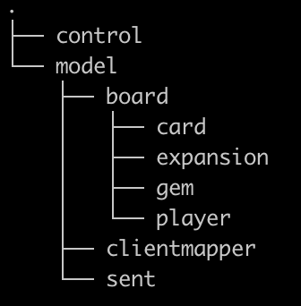

# Server Side Summary, by Package
------------

### Current package structure as of 16-1-2023

------------

### RestLauncher.java
- Just starts server application

### Mapper.java
- Archetype of a mapper which is extended in other classes

### Any mapper class
#### "XYMapper"
- Maps x to y
- All singletons
- Usually y is what is shown to player
- Usually x is what is kept on sever side
- Use map() function

## control Package

### All forms
#### "XForm"
- Represent the data passed between client and server 
- Passed through body of JSON objects

### GsonInstance.java
- Singleton
- Used to convert objects to and from JSON
- Uses google's GSON library through Maven

### LobbyService.java
- Singleton class
- Used to make all HTTP calls to lobby serivce
- Implements LobbyServiceCaller interface
	- The interface holds all methods used in LobbyService
- Can be called whenever needing to communicate with LS

### ServerService.java
- Registers the game service with lobby service
- Also unregisters game service

## model Package

### User.java
- Contains record of username and preferred color
- Based on Max's API

## model/clientmapper package

### ServerToClientMapper.java
- Extends Mapper.java
- Maps the serverside gameboard to a client-side game board
- Keeps info hidden from player

## model/sent package

### SendGameBoard.java
- Has info available to player
	- Face-up cards
	- Gems
	- Expansion
	- Other players, leading players
	- All player hands
	- Host
	- Etc
- Doesn't include info meant to be hidden from player
	- Face-down cards
	- Etc

## model/board package

## model/board/card package
- Contains all the types of cards
- Also contains some card attribute enums like CardLevel

## model/board/expansion package
- Contains mappers and enums describing expansions

## model/board/gem package
- Contains enums for gem color
- Gems.java represents enum to integer map
	- used to represent amt of gems in bank, cost of cards, payment of gems by player, and gems substitued for gold

## model/board/player package
- Contains player.java, and mappers between User.java and Player.java

### Player.java
- Contains a hand and playerId
- Also has getter functions

### Hand.java
- Contained in Player.java
- Contains number of cards, gems, and nobles (anything a player has)

### Noble.java
- Contains prestige points and gems associated with a noble

### GameBoard.java
- Instantiable (can have multiple)
- All in-use boards are stored in in GameHandlerController.java
- Contains all information of the current gamestate

